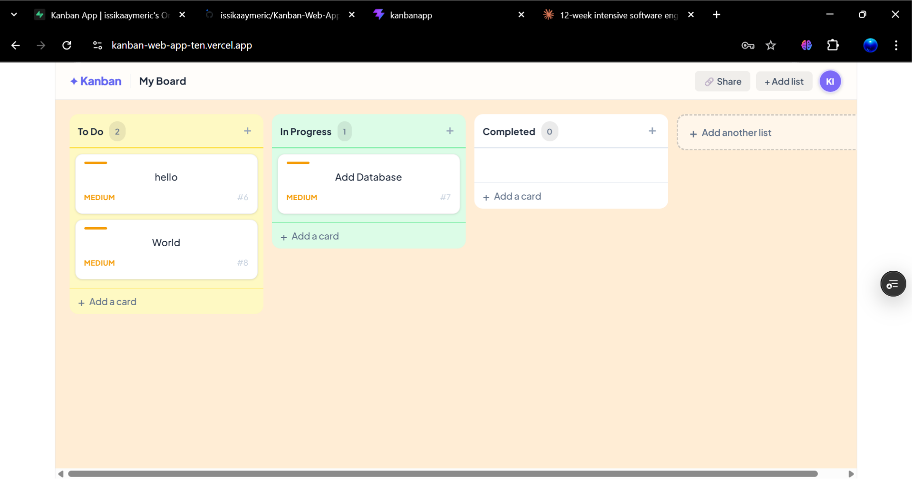

# ✦ Kanban Board App

A full-stack, real-time Kanban board built with React, Node.js/Express, and Supabase. Features drag-and-drop task management, user authentication, priority labels, and a customisable board experience — deployed and live on Vercel.

🔗 **Live Demo:** [kanban-web-app-ten.vercel.app](https://kanban-web-app-ten.vercel.app)

---

## 📸 Preview




---

## 🏗️ Architecture

```

                  Frontend                       
         React + @hello-pangea/dnd                
         Supabase Auth (client-side)              
                    REST API calls

                  Backend                         
           Node.js + Express                      
        /api/columns  /api/tasks                  

                   

                Supabase                         
    PostgreSQL Database + Auth Provider          

```

---

## ⚙️ Tech Stack

| Layer | Technology |
|---|---|
| Frontend | React 18, Vite |
| Drag & Drop | `@hello-pangea/dnd` |
| Backend | Node.js, Express |
| Auth | Supabase Auth (email + OAuth) |
| Database | Supabase (PostgreSQL) |
| Fonts | Plus Jakarta Sans (Google Fonts) |
| Deployment | Vercel (frontend) | Render (Backend)

---

## ✨ Features

- **Authentication** — Supabase-powered login/signup with session persistence and auto token refresh
- **Drag & Drop** — Move tasks between columns with optimistic UI updates
- **Column management** — Add custom columns dynamically
- **Task management** — Create, edit, and delete tasks via a full modal interface
- **Priority labels** — Tag tasks as Low / Medium / High
- **Board customisation** — Change board background colour and avatar via Settings
- **Share modal** — Share board link with collaborators
- **Sticky topbar** — Glassmorphism header with user avatar and initials
- **Error handling** — Graceful fallback if the backend is unreachable

---

## 🚀 Getting Started

### Prerequisites

- Node.js 18+
- A [Supabase](https://supabase.com) project (free tier works)

---

### 1. Clone the repository

```bash
git clone https://github.com/issikaaymeric/Kanban-Web-App.git
cd Kanban-Web-App
```

---

### 2. Set up the database

Run the following SQL in your Supabase SQL editor:

```sql
CREATE TABLE columns (
  id       SERIAL PRIMARY KEY,
  title    TEXT    NOT NULL,
  position INTEGER NOT NULL DEFAULT 0
);

CREATE TABLE tasks (
  id         SERIAL PRIMARY KEY,
  title      TEXT    NOT NULL,
  content    TEXT    DEFAULT '',
  column_id  INTEGER REFERENCES columns(id) ON DELETE CASCADE,
  priority   TEXT    DEFAULT 'medium',
  position   INTEGER DEFAULT 0,
  created_at TIMESTAMPTZ DEFAULT NOW()
);
```

---

### 3. Configure environment variables

**Frontend** — create `frontend/.env`:

```env
VITE_API_URL=http://localhost:5000/api
VITE_SUPABASE_URL=https://your-project.supabase.co
VITE_SUPABASE_ANON_KEY=your-anon-key
```

**Backend** — create `backend/.env`:

```env
SUPABASE_URL=https://your-project.supabase.co
SUPABASE_SERVICE_KEY=your-service-role-key
PORT=5000
```

---

### 4. Install and run

**Backend:**

```bash
cd backend
npm install
npm run dev
```

**Frontend:**

```bash
cd frontend
npm install
npm run dev
```

Open [http://localhost:5173](http://localhost:5173)

---

## 📁 Project Structure

```
Kanban-Web-App/
│
├── frontend/
│   ├── src/
│   │   ├── components/
│   │   │   ├── KanbanBoard.jsx     # Main board — drag/drop, columns, state
│   │   │   ├── Column.jsx          # Individual column with task list
│   │   │   ├── TaskModal.jsx       # Create / edit task modal
│   │   │   ├── Settings.jsx        # Board customisation panel
│   │   │   ├── ShareModal.jsx      # Share board link modal
│   │   │   ├── Auth.jsx            # Login / signup screen
│   │   │   └── supabaseClient.js   # Supabase client initialisation
│   │   └── App.jsx                 # Auth gate — session management
│   ├── index.html
│   └── vite.config.js
│
├── backend/
│   ├── routes/
│   │   ├── columns.js              # GET, POST /api/columns
│   │   └── tasks.js                # GET, POST, PATCH, DELETE /api/tasks
│   ├── supabaseClient.js           # Supabase service client
│   └── index.js                    # Express app entry point
│
└── README.md
```

---

## 🔌 API Reference

### Columns

| Method | Endpoint | Description |
|---|---|---|
| `GET` | `/api/columns` | Fetch all columns with their tasks |
| `POST` | `/api/columns` | Create a new column |

### Tasks

| Method | Endpoint | Description |
|---|---|---|
| `POST` | `/api/tasks` | Create a new task |
| `PATCH` | `/api/tasks/:id` | Update task fields |
| `PATCH` | `/api/tasks/:id/move` | Move task to a different column |
| `DELETE` | `/api/tasks/:id` | Delete a task |

---

## 🔑 Key Design Decisions

**Optimistic UI on drag-and-drop**
The board state updates immediately on drag, then syncs to the backend asynchronously. If the API call fails, the board re-fetches to restore the correct state — keeping the UI snappy without sacrificing data consistency.

**Supabase Auth on the client, Express on the backend**
Auth is handled entirely by Supabase on the frontend (session, token refresh, logout). The Express backend handles all data operations, keeping concerns cleanly separated.

**Component-level state over global store**
For a single-board app, React `useState` in `KanbanBoard.jsx` is sufficient. Adding Redux or Zustand would be over-engineering at this scale — a deliberate architectural choice.

---

## 🔮 Roadmap

- [ ] Supabase Realtime — live sync across multiple browser tabs and users
- [ ] Due dates and calendar view
- [ ] Task assignments (multi-user boards)
- [ ] Inline column title editing (replace native `prompt()`)
- [ ] Persist board settings to Supabase user metadata
---

## 👤 Author

**Issika Aymeric**
Computer Science Student
[LinkedIn]([https://www.linkedin.com/in/issika-aymeric-kouam%C3%A9-214866373/) · [GitHub](https://github.com/issikaaymeric) · [issikaaymeric.online](https://issikaaymeric.online)

